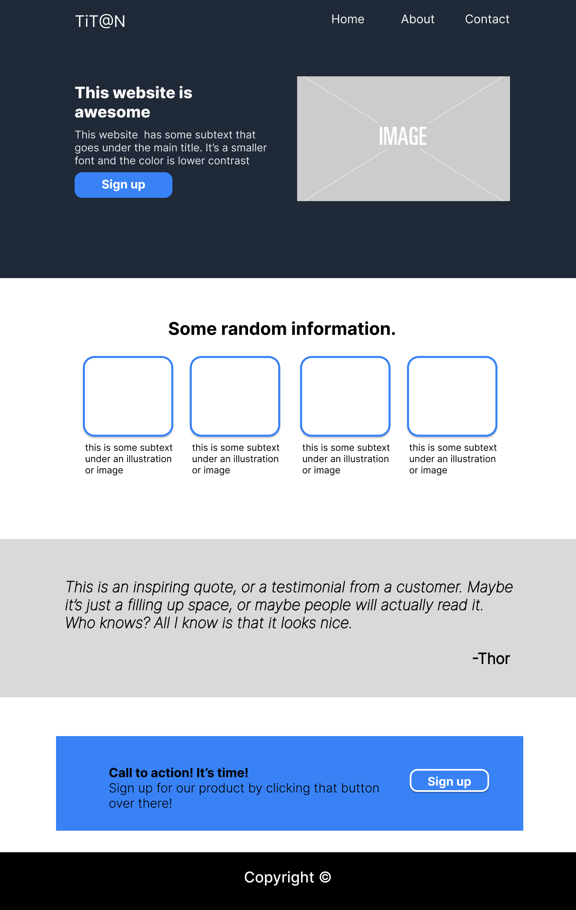
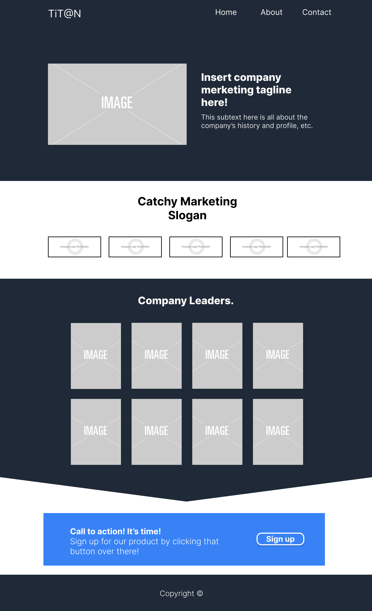
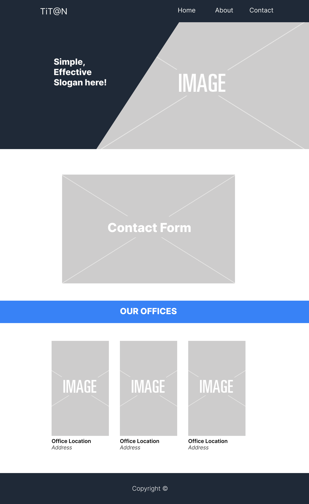
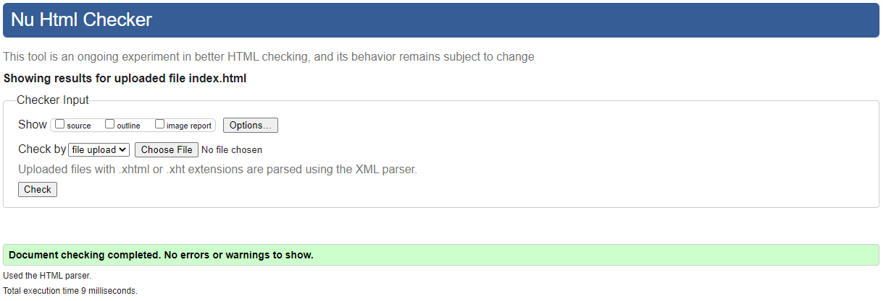
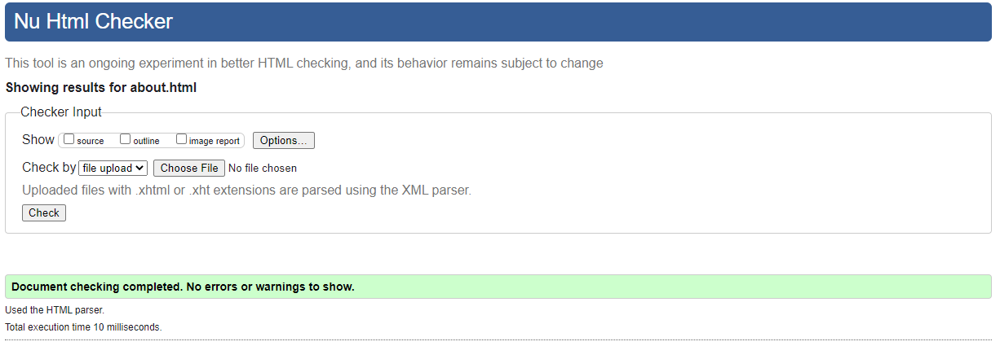
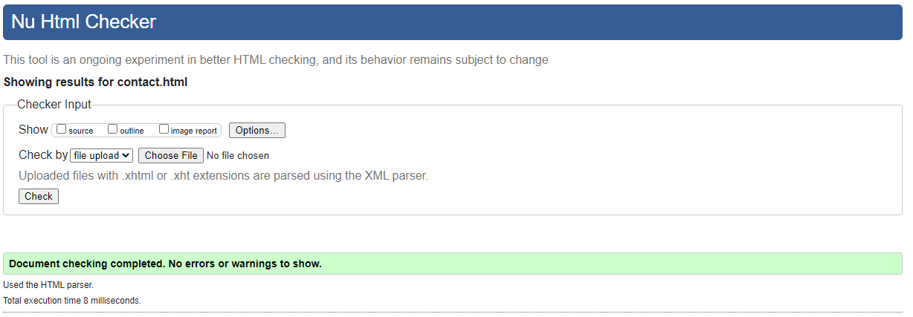
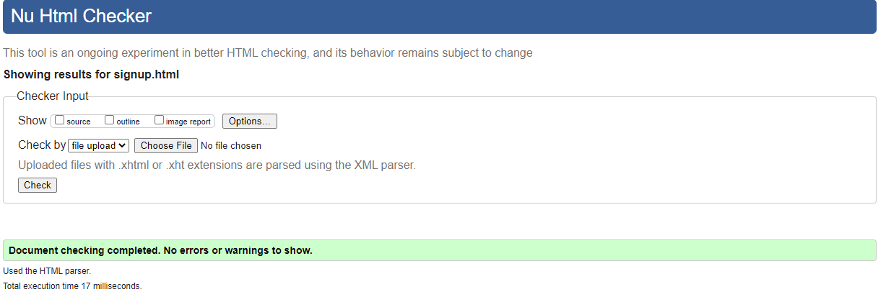
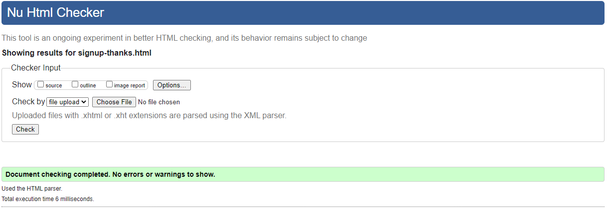
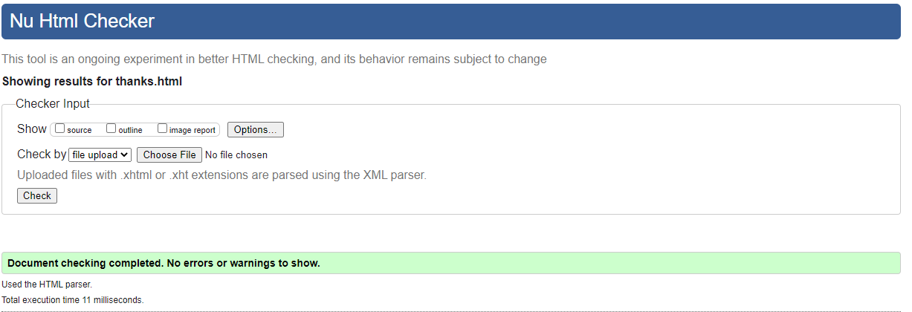
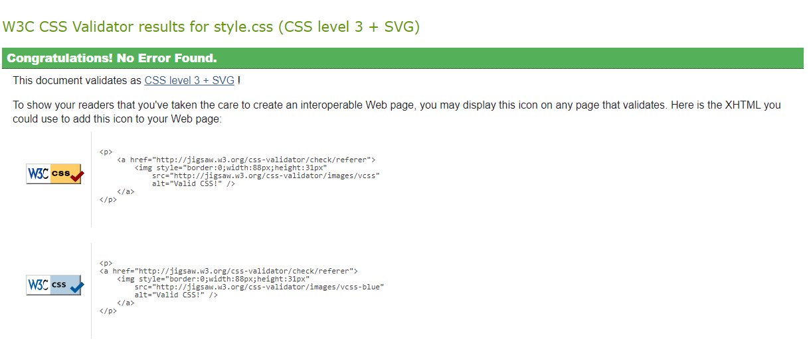

# Titan

Titan (stylized as TiT@N) is a fictitious *Digital Marketing Agency*. It is a growing business that helps its clients boost its presence in the market. It has three basic pages that users can navigate (Homepage, About Page and Contact Page). This website is made using pure HTML and CSS.

## Wireframes
The wireframes for this project were made digitally using [**Figma**](https://www.figma.com/).

Click To See Wireframes

### Homepage

### About Page

### Contact Page

 

## Validator Testing
HTML - No errors were returned when passing through the official [**W3C validator**](https://validator.w3.org/#validate_by_input+with_options). Also, for CSS - no errors were found when passing through the official [**(Jigsaw) validator**](https://jigsaw.w3.org/css-validator/#validate_by_input).

Click To See HTML Validations

### Homepage

### About Page

### Contact Page

### Signup Page

### Signup Thank You Page

### Contact Thank You Page

Click To See CSS Validation

### Homepage

 

## Deployment 
The site was deployed to GitHub pages. The steps to deploy are as follows:

    - Open a web browser (like Chrome, Firefox or Edge)
    - Login to Github and locate repositories.
    - In the GitHub repository, navigate to the Settings tab.
    - Go to pages tab and from the source section drop-down menu, select the main Branch and then click save button.
    - Once the main branch has been selected and saved, the page provided a link the completed website. 

- The live link can be found here - https://jtm2021.github.io/Titan/

 

## Media 
The images included in the website were taken from [Pexels.com](https://www.pexels.com/). The links are provided below:

Click To Links to IMages Used in This Website

### Main Images
https://www.pexels.com/photo/silver-imac-on-brown-wooden-table-6476193/
https://www.pexels.com/photo/photo-of-woman-using-laptop-3194518/
https://www.pexels.com/photo/photo-of-women-having-conversation-3194524/
https://www.pexels.com/photo/close-up-of-human-hand-327533/
https://www.pexels.com/photo/a-man-in-black-suit-wearing-eyeglasses-sitting-near-the-table-while-talking-to-his-colleague-4339911/
https://www.pexels.com/photo/man-with-his-hand-in-his-pocket-532220/
https://www.pexels.com/photo/woman-smiling-and-holding-teal-book-1181424/
https://www.pexels.com/photo/man-in-gray-suit-jacket-holding-silver-macbook-13222553/
https://www.pexels.com/photo/female-employee-leaning-on-handrails-7688302/
https://www.pexels.com/photo/a-woman-in-white-blazer-smiling-with-her-arms-crossed-8528852/
https://www.pexels.com/photo/woman-wearing-white-polo-long-sleeved-shirt-1181695/
https://www.pexels.com/photo/a-woman-in-knitted-blazer-smiling-with-her-arms-crossed-8528574/
https://www.pexels.com/photo/people-having-a-meeting-in-an-office-7688335/
https://www.pexels.com/photo/contemporary-skyscrapers-in-city-under-cloudless-blue-sky-6272255/
https://www.pexels.com/photo/modern-skyscrapers-in-london-city-7245344/
https://www.pexels.com/photo/high-rise-buildings-under-blue-sky-3779785/
https://www.pexels.com/photo/group-of-people-standing-infront-of-blackboard-3184432/
https://www.pexels.com/photo/selective-focus-photography-of-woman-using-macbook-pro-3584996/

### Portraits
https://www.pexels.com/photo/a-woman-in-knitted-blazer-smiling-with-her-arms-crossed-8528574/
https://www.pexels.com/photo/woman-wearing-white-polo-long-sleeved-shirt-1181695/
https://www.pexels.com/photo/a-woman-in-white-blazer-smiling-with-her-arms-crossed-8528852/
https://www.pexels.com/photo/female-employee-leaning-on-handrails-7688302/
https://www.pexels.com/photo/man-in-gray-suit-jacket-holding-silver-macbook-13222553/
https://www.pexels.com/photo/man-wearing-blue-button-up-sweater-1181391/
https://www.pexels.com/photo/woman-smiling-and-holding-teal-book-1181424/
https://www.pexels.com/photo/man-with-his-hand-in-his-pocket-532220/

## Logos
https://www.pngfind.com/download/oioRRT_ellesse-logo-png-transparent-svg-vector-freebie-supply/
https://www.pngfind.com/download/TmRbJh_waffle-house-logo-hd-png-download/
https://www.pngfind.com/download/iombThJ_ole-miss-baseball-logo-hd-png-download/
https://www.pngfind.com/download/ibRhRRo_southern-miss-golden-eagles-logo-png-transparent-southern/
https://www.pngfind.com/download/iRTmJmJ_without-these-fantastic-companies-ubc-relay-for-life/

 

## Credits
An image hover overlay used in this project was inspired by a video tutorial from youtube. Here is the link to that video: 

- https://www.youtube.com/watch?v=yfg9ChTmuKM

The clip-path CSS property was used in the about page of the website. A clip-path generator was used for this part. Here is the link to that website:

- https://www.cssportal.com/css-clip-path-generator/