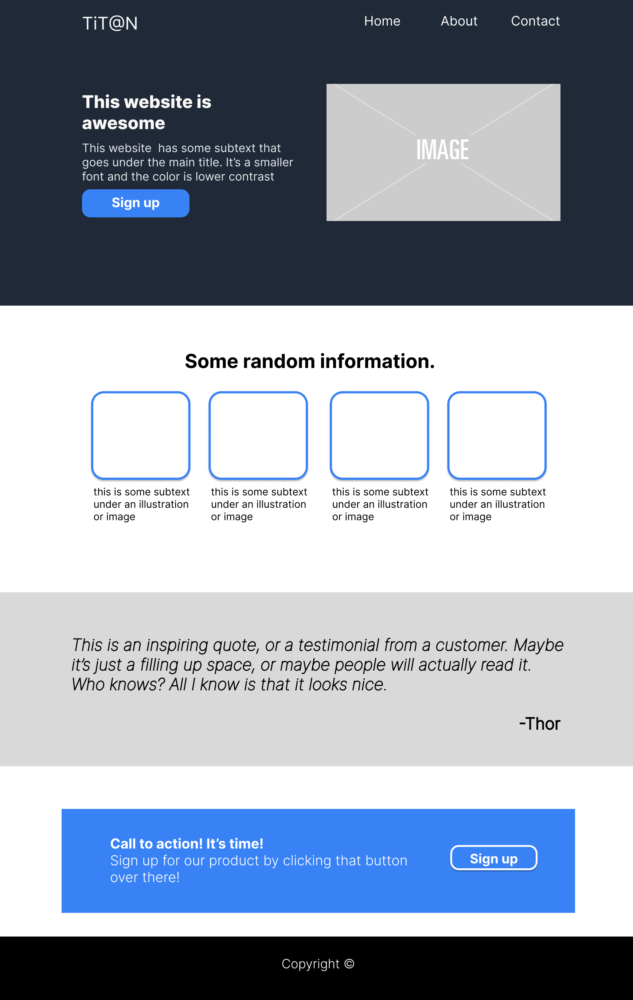

# Titan

Titan (stylized as TiT@N) is a *Digital Marketing Agency*. It is a growing business that helps its clients boost its presence in the market.

### Wireframes ###
The wireframes for this project were made digitally using [**Figma**](https://www.figma.com/).

Click To See Wireframes

### Homepage

### About Page

### Contact Page

### Media ###
- The images included in the website were taken from [Pexels.com](https://www.pexels.com/). The links are provided below:
    - Photo by Mikael Blomkvist: https://www.pexels.com/photo/silver-imac-on-brown-wooden-table-6476193/
    - Photo by Canva Studio: https://www.pexels.com/photo/photo-of-woman-using-laptop-3194518/
    - Photo by Canva Studio: https://www.pexels.com/photo/photo-of-women-having-conversation-3194524/
    - Photo by Pixabay: https://www.pexels.com/photo/close-up-of-human-hand-327533/
    - Photo by Edmond Dantès: https://www.pexels.com/photo/a-man-in-black-suit-wearing-eyeglasses-sitting-near-the-table-while-talking-to-his-colleague-4339911/
    - Photo by RODNAE Productions: https://www.pexels.com/photo/person-holding-gray-and-white-box-7564251/

